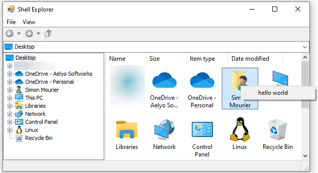

# Gong Solutions Shell Library
[The Gong Solutions Shell Library](https://gong-shell.sourceforge.net/) provides controls to enable embedding Windows Explorer-like functionality into .Net 2.0 programs and for creating custom file dialogs. It provides a clean interface into the Windows Shell Namespace from code, allowing easy access to virtual folders such as the Recycle Bin.

# Easily Create Cusom File Dialogs
Using the Gong Solutions Shell Library, you can create custom file dialogs with just a few lines of code. Just drop a FileDialogToolbar control and a ShellView control onto your form, link them together and you have a basic file dialog!

[See the tutorial here](./Tutorial/1.FileDialog.md)

# Embed Windows Explorer in your Applications
Using the Gong Solutions Shell Library, you can embed Windows explorer in your applications by simply adding two controls. Just drop a ShellTreeView control and a ShellView control onto your form, link them together and you can be browsing in no time!

[See the tutorial here](./Tutorial/2.Explorer.md)

# Access the Windows Shell from Code
The Windows Shell is a notoriously difficult API to code to. The Gong Solutions Shell Library provides a clean, flexible, user friendly route into the Shell Namespace from code
```cs
using System;
using GongSolutions.Shell;

namespace ConsoleApplication1 
{
    class Program 
    {
        static void Main(string[] args) 
        {
            ShellItem folder = new ShellItem(Environment.SpecialFolder.MyDocuments);

            foreach (ShellItem item in folder) 
            {
                Console.WriteLine(item.FileSystemPath);
            } 
        } 
    } 
}    
```

I also added a few [unofficial features](https://stackoverflow.com/questions/75519245/is-it-possible-to-turn-off-contextmenu-option-in-gong-shell-listview/75524366?noredirect=1#comment133260561_75524366).



1. enable window context menu
```cs
var shellView = new ShellView();
shellView.CustomContextMenuEnable = true;
shellView.ContextMenuStrip = new ContextMenuStrip();
shellView.ItemContextMenuStrip = new ContextMenuStrip();
```

# License
[MIT](./Licence.md)
