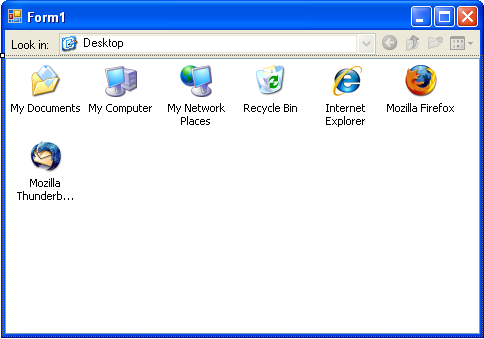
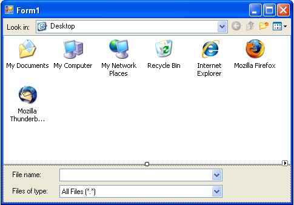

# Creating a Simple File Dialog
This tutorial will guide you through creating a simple custom file dialog in Visual Studio 2005 using the Gong Solutions Shell Library.

# 1. Create a new project
Create a new Windows Application in Visual Studio and add a reference to the Gong Solutions Shell Library to your project. For more details, click here.

# 2. Add some controls
Add a FileDialogToolbar control to your form. It will automatically dock itself to the top of the form.
Add a ShellView control to your form. Set its Dock property to Fill.
You form should look like this:



# 3. Link the Controls
Set the ShellView property of the FileDialogToolbar to reference the ShellView control on the form.

# 4. Run the Program
Press F5 to run the program, and you will be able to browse your computer's files from your newly created application, as simple as that!

# 5. Add a File Name Text Box and a File Filter List
Add a new Panel to your form, and set its Dock property to Bottom. You may need to right-click it and select "Send to Back" to make sure it doesn't overlap your ShellView
Add a FileNameComboBox and a FileFilterComboBox to the Panel
Set the ShellView property of both these controls to reference the ShellView control on the form.
Set the FilterItems property of the FileFilterComboBox to Text Files (*.txt)|*.txt|All Files (*.*)|*.*
Add some labels to make things look nicer.
You form should now look something like this:



# 6. Run the Program
Press F5 to run the program again. You will now be able to navigate folders by typing their name into the FileNameComboBox and filter the items in the ShellView using the FileFilterComboBox . The FileNameComboBox will even autocomplete filenames as you type!

# 7. Add the Open button
Add a new Button to your form, and set its Text property to Open.
In the button's Clicked event handler put the following code:

```cs
private void button1_Click(object sender, EventArgs e) {
    if ((shellView1.SelectedItems.Length > 0) &&
        (!shellView1.NavigateSelectedFolder())) {
        MessageBox.Show(shellView1.SelectedItems[0].FileSystemPath);
    }
}
```
            
That's All For Now
You've come to the end of this tutorial. If you want to learn more, then take a look at the FileDialog example that comes with the Gong Solutions Shell Library.
