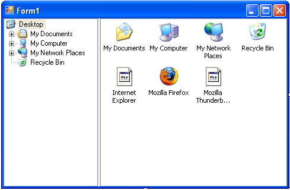

# Creating a Simple Windows Explorer Clone
This tutorial will guide you through creating a simple clone of Windows Explorer in Visual Studio 2005 using the Gong Solutions Shell Library.

# 1. Create a new project
Create a new Windows Application in Visual Studio and add a reference to the Gong Solutions Shell Library to your project. For more details, click here.

# 2. Add some controls
Add a Windows Forms SplitContainer control.
Add a ShellTreeView control to the left-hand pane of the SplitContainer and set its Dock property to Fill.
Add a ShellView control to the left-hand pane of the SplitContainer and set its Dock property to Fill.
You form should look like this:

# 3. Link the Controls
Set the ShellView property of the ShellTreeView to reference the ShellView control on the form.

# 4. Run the Program
Press F5 to run the program, and you will be able to browse your computer's files from your newly created application, as simple as that!

That's All For Now
You've come to the end of this tutorial. If you want to learn more, then take a look at the ShellExplorer example that comes with the Gong Solutions Shell Library.
